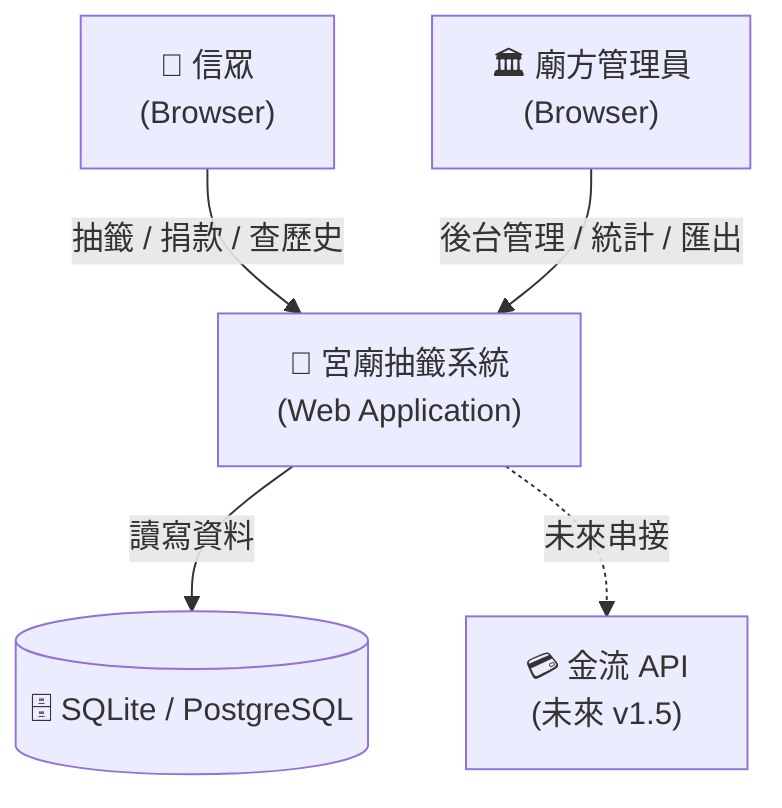
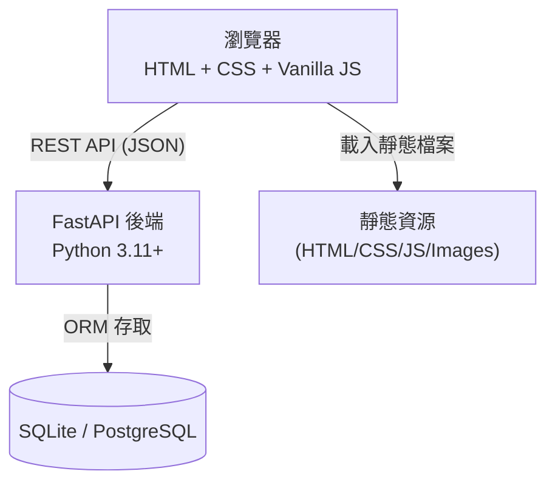
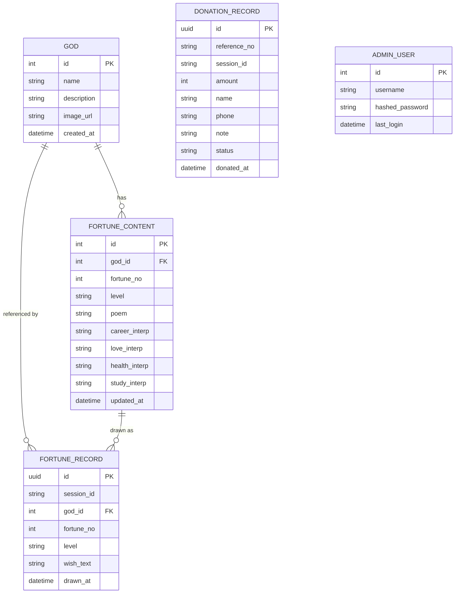
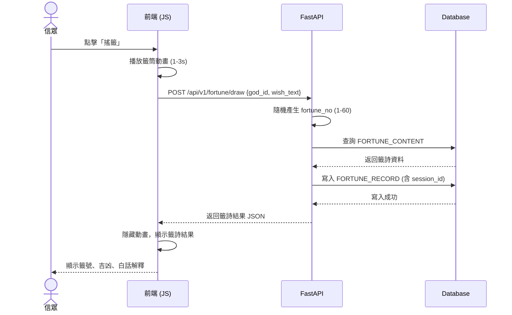
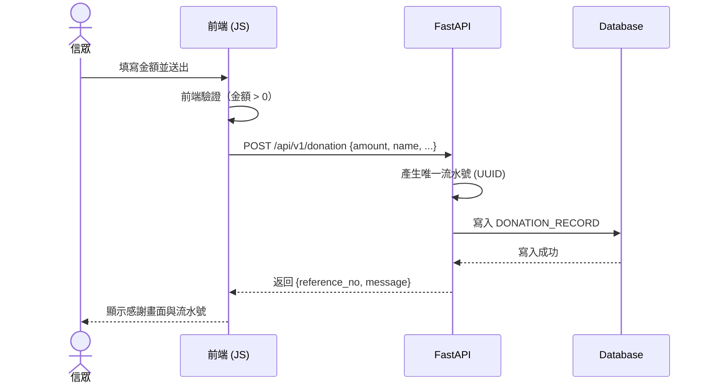
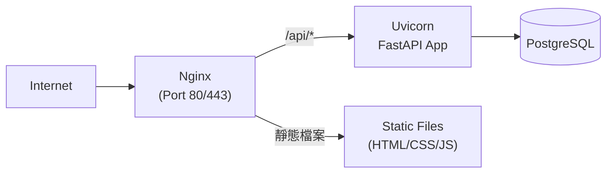

# 宮廟抽籤系統 — 架構設計文件（ADD）

## 一、文件基本資訊

| 欄位     | 說明                                              |
| -------- | ------------------------------------------------- |
| 文件標題 | 宮廟抽籤系統架構設計（Temple Fortune Stick ADD） |
| 版本號   | v1.0                                              |
| 作者     | 技術負責人                                        |
| 審閱者   | 後端工程師、前端工程師、DevOps                    |
| 建立日期 | 2026-04-22                                        |
| 最後更新 | 2026-04-22                                        |
| 狀態     | 草稿                                              |
| 關聯文件 | 宮廟抽籤系統_PRD.md v1.0                          |

---

## 二、背景與動機（Context & Motivation）

### 現況描述
本系統為全新開發，無既有系統需遷移。廟方目前以紙本管理籤詩與香油錢捐款。

### 問題與挑戰
- 無數位化紀錄，資料難以查詢與統計
- 信眾抽籤體驗受限於廟宇營業時間與地點
- 捐款紀錄不透明，廟方與信眾雙方都缺乏信任基礎

### 設計目標
1. 以 **Monolith 單體架構** 快速交付 MVP，降低複雜度
2. 前後端分離，前端 Vanilla JS，後端 FastAPI REST API
3. 資料持久化於 SQLite（開發）/ PostgreSQL（正式），支援未來水平擴展
4. Session-based 識別信眾，無需登入帳號

### 不在此次範圍內
- 真實金流串接（v1.5）
- 多廟宇 SaaS 架構（v2.0）
- 行動 App（v2.0）
- AI 籤詩解析（v2.0）

---

## 三、架構目標與非目標（Goals & Non-Goals）

| 類型   | 說明 |
| ------ | ---- |
| **目標** | API 回應時間 < 300ms；頁面載入 < 2s |
| **目標** | 服務可用率 ≥ 99%（月統計） |
| **目標** | 支援手機、桌機主流瀏覽器（Chrome、Safari、Firefox） |
| **目標** | 管理後台有 Session 保護，一般頁面無需登入 |
| **非目標** | 不支援即時多人同步（WebSocket）|
| **非目標** | 不實作真實付款流程 |
| **非目標** | 不支援多語系切換 |

---

## 四、架構概覽（Architecture Overview）

### 4.1 C4 Context Diagram



### 4.2 Container Diagram



### 4.3 主要組件

| 組件 | 職責 |
| ---- | ---- |
| `frontend/` | 信眾端頁面：首頁、抽籤頁、捐款頁、歷史紀錄頁 |
| `admin/` | 廟方後台：登入、統計、捐款明細、籤詩管理 |
| `api/routers/fortune.py` | 抽籤相關 API |
| `api/routers/donation.py` | 捐款相關 API |
| `api/routers/admin.py` | 管理後台 API |
| `api/models/` | SQLAlchemy ORM 資料模型 |
| `api/database.py` | 資料庫連線管理 |

---

## 五、技術選型（Technology Stack）

| 層次 | 技術選擇 | 選擇理由 | 被淘汰的替代方案 |
| ---- | -------- | -------- | ---------------- |
| 前端 | Vanilla HTML/CSS/JS | 零依賴、相容性佳、符合 PRD 規範 | React、Vue |
| 後端框架 | FastAPI (Python 3.11+) | 自動產生 API 文件、型別安全、開發效率高 | Django、Flask |
| ORM | SQLAlchemy 2.0 | 成熟穩定、支援多資料庫切換 | Tortoise-ORM |
| 資料庫（開發） | SQLite | 零配置、方便本機開發 | — |
| 資料庫（正式） | PostgreSQL 15 | ACID 支援、可靠性高 | MySQL |
| Session 管理 | itsdangerous（簽名 Cookie） | 輕量、FastAPI 原生整合 | Redis Session |
| 部署（MVP） | Uvicorn + 單台 VPS | 簡單、低成本 | Docker + K8s |
| 未來部署 | Docker Compose | 環境一致性 | K8s（過重） |

---

## 六、詳細架構設計（Detailed Design）

### 6.1 目錄結構

```
temple-fortune/
├── backend/
│   ├── main.py               # FastAPI 入口
│   ├── database.py           # DB 連線
│   ├── models/
│   │   ├── fortune.py        # 籤詩、抽籤紀錄
│   │   └── donation.py       # 捐款紀錄
│   ├── routers/
│   │   ├── fortune.py        # 抽籤 API
│   │   ├── donation.py       # 捐款 API
│   │   └── admin.py          # 後台 API
│   ├── schemas/              # Pydantic 請求/回應模型
│   ├── services/             # 業務邏輯層
│   └── seed_data.py          # 初始籤詩資料
├── frontend/
│   ├── index.html            # 首頁（神明選擇）
│   ├── fortune.html          # 抽籤頁
│   ├── donation.html         # 捐款頁
│   ├── history.html          # 歷史紀錄頁
│   ├── css/
│   │   └── style.css
│   └── js/
│       ├── fortune.js
│       ├── donation.js
│       └── history.js
├── admin/
│   ├── login.html
│   ├── dashboard.html        # 統計總覽
│   ├── donations.html        # 捐款明細
│   └── fortunes-mgmt.html   # 籤詩管理
└── requirements.txt
```

### 6.2 API 設計

所有 API 以 `/api/v1` 為前綴，回應格式統一為 JSON。

#### 抽籤模組

| Method | Endpoint | 說明 |
| ------ | -------- | ---- |
| GET | `/api/v1/gods` | 取得神明列表 |
| POST | `/api/v1/fortune/draw` | 執行抽籤，回傳籤詩 |
| GET | `/api/v1/fortune/history` | 查詢抽籤歷史（依 session_id）|
| GET | `/api/v1/fortune/{fortune_no}` | 取得指定籤詩內容 |

**POST `/api/v1/fortune/draw` 請求範例：**
```json
{
  "god_id": 1,
  "wish_text": "事業順利"
}
```

**回應範例：**
```json
{
  "record_id": "uuid-xxx",
  "fortune_no": 32,
  "level": "大吉",
  "poem": "春風得意馬蹄疾，一日看盡長安花。",
  "interpretation": {
    "career": "事業鴻圖大展，把握時機行動。",
    "love": "感情甜蜜，緣份天定。",
    "health": "身體健康，注意飲食即可。",
    "study": "學業進步，用功必有所成。"
  },
  "drawn_at": "2026-04-22T10:30:00+08:00"
}
```

#### 捐款模組

| Method | Endpoint | 說明 |
| ------ | -------- | ---- |
| POST | `/api/v1/donation` | 建立捐款紀錄 |
| GET | `/api/v1/donation/history` | 查詢捐款歷史（依 session_id） |
| GET | `/api/v1/donation/{reference_no}` | 依流水號查詢單筆 |

**POST `/api/v1/donation` 請求範例：**
```json
{
  "amount": 300,
  "name": "王小明",
  "phone": "0912345678",
  "note": "祈求全家平安"
}
```

#### 管理後台（需 Session 驗證）

| Method | Endpoint | 說明 |
| ------ | -------- | ---- |
| POST | `/api/v1/admin/login` | 管理員登入 |
| POST | `/api/v1/admin/logout` | 登出 |
| GET | `/api/v1/admin/donations/stats` | 捐款統計（日/週/月） |
| GET | `/api/v1/admin/donations` | 捐款明細列表（支援篩選） |
| GET | `/api/v1/admin/donations/export` | 匯出 CSV |
| GET | `/api/v1/admin/fortune/stats` | 抽籤統計 |
| POST | `/api/v1/admin/fortune-content` | 新增籤詩 |
| PUT | `/api/v1/admin/fortune-content/{id}` | 編輯籤詩 |
| DELETE | `/api/v1/admin/fortune-content/{id}` | 刪除籤詩 |

### 6.3 資料模型

#### ER Diagram



#### 索引策略

| 資料表 | 索引欄位 | 理由 |
| ------ | -------- | ---- |
| `fortune_record` | `session_id`, `drawn_at` | 歷史查詢效能 |
| `donation_record` | `session_id`, `donated_at` | 歷史查詢效能 |
| `donation_record` | `reference_no` | 流水號查詢唯一性 |
| `fortune_content` | `(god_id, fortune_no)` | 抽籤結果查詢 |

### 6.4 資料流程

#### 抽籤流程時序圖



#### 捐款流程時序圖



---

## 七、跨切面關注點（Cross-Cutting Concerns）

### 7.1 安全性（Security）

| 威脅 | 防禦方式 |
| ---- | -------- |
| SQL Injection | 使用 SQLAlchemy ORM，不拼接 SQL 字串 |
| XSS | 前端使用 `textContent` 而非 `innerHTML` 顯示資料 |
| CSRF | 後台 API 使用 CSRF Token（Cookie + Header 雙驗證） |
| 管理員暴力破解 | 登入失敗 5 次鎖定 15 分鐘 |
| Session 劫持 | Cookie 設定 `HttpOnly`、`Secure`、`SameSite=Strict` |
| 敏感資料 | 電話號碼儲存時進行部分遮罩（`0912***678`）|

**管理員認證流程：**
- 密碼使用 `bcrypt` hash 儲存
- Session 以 `itsdangerous` 簽名，30 分鐘無操作自動失效
- 所有後台 API 加入 `verify_admin_session` 依賴注入

### 7.2 效能與擴展性

- **靜態資源快取**：前端 HTML/CSS/JS 設定 `Cache-Control: max-age=86400`
- **資料庫連線池**：SQLAlchemy 連線池設定 `pool_size=10, max_overflow=20`
- **分頁設計**：所有列表 API 預設 `limit=20`，避免一次撈取大量資料
- **未來擴展**：PostgreSQL 支援讀寫分離；捐款紀錄可加 Redis 快取統計數字

### 7.3 可用性與容錯

- **輸入驗證**：Pydantic Schema 在 API 層攔截非法輸入，回傳 422
- **錯誤處理**：全域 Exception Handler，統一回傳 `{code, message}` 格式
- **前端容錯**：網路請求失敗時顯示 Toast 通知，保留用戶輸入不清空
- **資料備份**：SQLite 每日自動備份；PostgreSQL 使用 pg_dump 排程

### 7.4 可觀測性（Observability）

| 類型 | 工具 / 方式 |
| ---- | ----------- |
| 日誌 | Python `logging`，JSON 格式輸出至檔案 |
| 存取日誌 | Uvicorn access log，記錄所有 API 請求 |
| 錯誤追蹤 | 未來可接入 Sentry |
| 健康檢查 | `GET /health` 端點，回傳系統狀態與 DB 連線狀態 |

### 7.5 部署與維運（Deployment）

#### 環境規劃

| 環境 | 說明 | 資料庫 |
| ---- | ---- | ------ |
| Local（開發） | 本機直接執行 `uvicorn` | SQLite |
| Staging | VPS 上 Docker Compose | PostgreSQL |
| Production | VPS 上 Docker Compose + Nginx 反向代理 | PostgreSQL |

#### 部署架構圖



#### CI/CD 流程（建議）

```
git push → GitHub Actions → 跑測試 → 建 Docker Image → SSH 部署至 VPS → 健康檢查
```

---

## 八、架構決策記錄（ADR）

### ADR-001：使用 Monolith 而非 Microservices

**日期**：2026-04-22
**狀態**：已接受

**背景**：系統為 MVP 階段，功能模組少，團隊規模小。

**決策**：採用單體架構（Monolith），所有模組在同一 FastAPI 應用內以 Router 區分。

**理由**：微服務帶來的部署、網路、除錯複雜度，在 MVP 階段是不必要的負擔；單體架構開發速度更快，未來若有需要可漸進式拆分。

**後果**：✅ 開發快、部署簡單；⚠️ 未來擴展需重構，但符合 PRD 的 v1.0 範圍。

---

### ADR-002：Session 識別取代帳號系統

**日期**：2026-04-22
**狀態**：已接受

**背景**：PRD 中「會員帳號系統」為 Out of Scope（v1.2 規劃），但需識別信眾的歷史紀錄。

**決策**：以瀏覽器 Cookie 中的 Session ID（UUID）識別用戶，無需登入。

**理由**：降低用戶門檻，提升信眾使用意願；Session ID 對一般信眾的隱私影響低。

**後果**：✅ 使用者體驗佳，無需註冊；⚠️ 跨裝置查詢歷史紀錄無法做到，v1.2 導入帳號系統後可解決。

---

### ADR-003：前端使用 Vanilla JS 而非框架

**日期**：2026-04-22
**狀態**：已接受

**背景**：PRD 技術選型已明確指定 Vanilla HTML/CSS/JS。

**決策**：不引入 React / Vue，使用原生 DOM API 與 `fetch`。

**理由**：減少學習成本與構建工具複雜度；提升頁面載入效能；廟方系統不需高度動態的 SPA 行為。

**後果**：✅ 零構建工具依賴、快速載入；⚠️ 複雜互動需自行管理狀態，但 v1.0 功能範圍可接受。

---

## 九、相依關係與整合（Dependencies & Integrations）

| 類型 | 項目 | 版本 | 整合方式 |
| ---- | ---- | ---- | -------- |
| 後端框架 | FastAPI | >= 0.110 | 核心框架 |
| 資料驗證 | Pydantic | v2 | Schema 定義 |
| ORM | SQLAlchemy | 2.0 | 資料庫存取 |
| 密碼加密 | passlib[bcrypt] | >= 1.7 | 管理員密碼 |
| Session 簽名 | itsdangerous | >= 2.1 | Cookie 安全 |
| ASGI 伺服器 | Uvicorn | >= 0.29 | 生產執行 |
| 資料庫驅動 | aiosqlite / asyncpg | — | 異步 DB 存取 |

---

## 十、遷移計畫（Migration Plan）

本系統為全新建置，無舊系統遷移需求。

**籤詩初始資料匯入：**
1. 廟方提供籤詩 Excel / CSV
2. 開發 `seed_data.py` 腳本一次性匯入
3. 上線後可透過後台管理介面維護

---

## 十一、風險與未解問題（Risks & Open Questions）

| # | 風險 / 問題 | 嚴重度 | 因應策略 | 負責人 | 狀態 |
|---|-------------|--------|----------|--------|------|
| 1 | 籤詩資料未備妥，影響開發進度 | 高 | 先以假資料開發，待廟方提供後替換 | PM | 待確認 |
| 2 | SQLite 在高並發下有寫入鎖問題 | 中 | 正式環境改用 PostgreSQL | 後端 | 進行中 |
| 3 | Session Cookie 被竊取導致捐款紀錄洩露 | 中 | 確保 HTTPS 部署；Cookie 設 HttpOnly | 後端 | 待確認 |
| 4 | 管理員帳密以預設值上線 | 高 | 上線前強制更改密碼，CI 檢查預設密碼 | DevOps | 待確認 |
| 5 | 手機鍵盤彈出破壞動畫版面 | 低 | 測試期間針對手機版修正 CSS | 前端 | 待確認 |

---

## 十二、詞彙表（Glossary）

| 術語 | 定義 |
|------|------|
| Session ID | 存放於 Cookie 的唯一識別碼，用於關聯同一瀏覽器的操作紀錄 |
| Fortune No | 籤號，範圍 1–60，對應特定籤詩內容 |
| Reference No | 捐款流水號，UUID 格式，供信眾查詢單筆紀錄 |
| ORM | Object-Relational Mapping，物件關聯對映 |
| ADR | Architecture Decision Record，架構決策記錄 |
| SLA | Service Level Agreement，服務等級協議 |
| CSRF | Cross-Site Request Forgery，跨站請求偽造 |
| XSS | Cross-Site Scripting，跨站腳本攻擊 |
