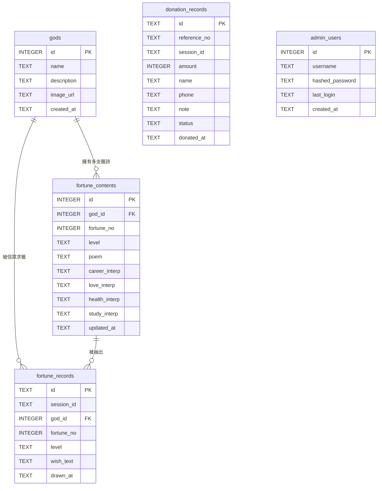

# 宮廟抽籤系統 — 資料模型文件

## 一、文件基本資訊

| 欄位     | 說明                                          |
| -------- | --------------------------------------------- |
| 文件標題 | 宮廟抽籤系統資料模型（Data Model Document）   |
| 版本號   | v1.0                                          |
| 作者     | 後端工程師                                    |
| 審閱者   | 技術負責人                                    |
| 建立日期 | 2026-04-22                                    |
| 最後更新 | 2026-04-22                                    |
| 狀態     | 草稿                                          |
| 關聯文件 | 宮廟抽籤系統_PRD.md、宮廟抽籤系統_ADD.md      |

---

## 二、資料模型概覽（Overview）

本文件涵蓋宮廟抽籤系統的三大業務領域：

- **抽籤領域**：神明、籤詩內容、抽籤紀錄
- **捐款領域**：香油錢捐贈紀錄
- **管理領域**：後台管理員帳號

**資料庫類型**：關聯式資料庫（SQLite）

| 實體 | 資料表名稱 | 用途 |
| ---- | ---------- | ---- |
| 神明 | `gods` | 系統支援的神明清單 |
| 籤詩內容 | `fortune_contents` | 每支籤的詩文與白話解釋 |
| 抽籤紀錄 | `fortune_records` | 信眾每次抽籤的歷史 |
| 捐款紀錄 | `donation_records` | 香油錢捐贈的歷史 |
| 管理員 | `admin_users` | 廟方後台帳號 |

---

## 三、實體關聯圖（ER Diagram）



---

## 四、實體定義（Entity Definitions）

### 4.1 神明（God）

**說明**：代表系統中供信眾選擇請示的神明。

**資料表名稱**：`gods`

#### 欄位定義

| 欄位名稱 | 資料型別 | 必填 | 預設值 | 說明 |
| -------- | -------- | ---- | ------ | ---- |
| `id` | INTEGER | ✅ | AUTOINCREMENT | 主鍵 |
| `name` | TEXT | ✅ | — | 神明名稱（如：媽祖） |
| `description` | TEXT | ❌ | NULL | 神明簡介 |
| `image_url` | TEXT | ❌ | NULL | 神明圖片路徑 |
| `created_at` | TEXT (ISO8601) | ✅ | CURRENT_TIMESTAMP | 建立時間 |

#### 限制與規則

- PK：`id`
- UNIQUE：`name`（每位神明名稱不可重複）

#### 業務規則

- 初始資料至少包含 3 位神明：媽祖、關聖帝君、城隍爺
- 刪除神明前，需確認該神明下無關聯籤詩

---

### 4.2 籤詩內容（Fortune Content）

**說明**：每支籤的詩文、吉凶等級、各面向白話解釋。籤詩由系統自行建立。

**資料表名稱**：`fortune_contents`

#### 欄位定義

| 欄位名稱 | 資料型別 | 必填 | 預設值 | 說明 |
| -------- | -------- | ---- | ------ | ---- |
| `id` | INTEGER | ✅ | AUTOINCREMENT | 主鍵 |
| `god_id` | INTEGER | ✅ | — | 所屬神明 FK → `gods.id` |
| `fortune_no` | INTEGER | ✅ | — | 籤號（1–60） |
| `level` | TEXT | ✅ | — | 吉凶等級 |
| `poem` | TEXT | ✅ | — | 籤詩全文（四句漢字） |
| `career_interp` | TEXT | ✅ | — | 事業面白話解釋 |
| `love_interp` | TEXT | ✅ | — | 感情面白話解釋 |
| `health_interp` | TEXT | ✅ | — | 健康面白話解釋 |
| `study_interp` | TEXT | ✅ | — | 學業面白話解釋 |
| `updated_at` | TEXT (ISO8601) | ✅ | CURRENT_TIMESTAMP | 最後更新時間 |

#### 限制與規則

- PK：`id`
- FK：`god_id` → `gods.id`（ON DELETE RESTRICT）
- UNIQUE：`(god_id, fortune_no)`（同一神明下籤號不可重複）
- CHECK：`fortune_no >= 1 AND fortune_no <= 60`
- CHECK：`level IN ('大吉', '中吉', '小吉', '吉', '凶')`

#### 業務規則

- 每位神明預設 60 支籤（`fortune_no` 1–60）
- 管理員可透過後台修改籤詩內容與解釋，修改後即時生效
- 籤詩資料由系統 seed 腳本自行建立

---

### 4.3 抽籤紀錄（Fortune Record）

**說明**：記錄信眾每次抽籤的完整資訊，用於歷史紀錄查詢。

**資料表名稱**：`fortune_records`

#### 欄位定義

| 欄位名稱 | 資料型別 | 必填 | 預設值 | 說明 |
| -------- | -------- | ---- | ------ | ---- |
| `id` | TEXT (UUID) | ✅ | uuid4() | 主鍵，唯一識別碼 |
| `session_id` | TEXT | ✅ | — | 瀏覽器 Session ID，識別用戶 |
| `god_id` | INTEGER | ✅ | — | 請示的神明 FK → `gods.id` |
| `fortune_no` | INTEGER | ✅ | — | 抽到的籤號 |
| `level` | TEXT | ✅ | — | 吉凶等級（快照） |
| `wish_text` | TEXT | ❌ | NULL | 信眾祈願文字 |
| `drawn_at` | TEXT (ISO8601) | ✅ | CURRENT_TIMESTAMP | 抽籤時間 |

#### 限制與規則

- PK：`id`
- FK：`god_id` → `gods.id`（ON DELETE RESTRICT）
- INDEX：`session_id`（依用戶查歷史）
- INDEX：`drawn_at`（依時間排序）
- INDEX：`(session_id, drawn_at)`（複合索引，歷史查詢分頁）

#### 業務規則

- 每次抽籤立即寫入，不可修改或刪除（僅追加）
- `level` 為快照值，即使後續修改籤詩內容，歷史紀錄不受影響
- 以 `session_id` 關聯同一瀏覽器的所有紀錄

---

### 4.4 捐款紀錄（Donation Record）

**說明**：記錄信眾香油錢捐贈意願，本版為紀錄性質（非實際金流）。

**資料表名稱**：`donation_records`

#### 欄位定義

| 欄位名稱 | 資料型別 | 必填 | 預設值 | 說明 |
| -------- | -------- | ---- | ------ | ---- |
| `id` | TEXT (UUID) | ✅ | uuid4() | 主鍵 |
| `reference_no` | TEXT | ✅ | 系統產生 | 流水號（供信眾查詢用） |
| `session_id` | TEXT | ✅ | — | 瀏覽器 Session ID |
| `amount` | INTEGER | ✅ | — | 捐款金額（新台幣，整數） |
| `name` | TEXT | ❌ | NULL | 捐款人姓名（🔒 PII） |
| `phone` | TEXT | ❌ | NULL | 聯絡電話（🔒 PII，儲存時部分遮罩） |
| `note` | TEXT | ❌ | NULL | 心願備註 |
| `status` | TEXT | ✅ | 'recorded' | 狀態 |
| `donated_at` | TEXT (ISO8601) | ✅ | CURRENT_TIMESTAMP | 捐款時間 |

#### 限制與規則

- PK：`id`
- UNIQUE：`reference_no`
- INDEX：`session_id`（依用戶查歷史）
- INDEX：`donated_at`（依時間排序、統計用）
- INDEX：`(session_id, donated_at)`（複合索引）
- CHECK：`amount >= 1`（最低 1 元）
- CHECK：`status IN ('recorded', 'cancelled')`

#### 業務規則

- 捐款紀錄建立後預設 `status = 'recorded'`
- 本版不串接金流，介面需標示「此為意願記錄，非實際金流」
- `reference_no` 格式：`DON-YYYYMMDD-XXXX`（日期 + 四碼流水號）
- 電話儲存時遮罩處理：`0912***678`

---

### 4.5 管理員（Admin User）

**說明**：廟方後台管理帳號，用於登入管理系統。

**資料表名稱**：`admin_users`

#### 欄位定義

| 欄位名稱 | 資料型別 | 必填 | 預設值 | 說明 |
| -------- | -------- | ---- | ------ | ---- |
| `id` | INTEGER | ✅ | AUTOINCREMENT | 主鍵 |
| `username` | TEXT | ✅ | — | 帳號名稱 |
| `hashed_password` | TEXT | ✅ | — | bcrypt 雜湊密碼（🔒） |
| `last_login` | TEXT (ISO8601) | ❌ | NULL | 最後登入時間 |
| `created_at` | TEXT (ISO8601) | ✅ | CURRENT_TIMESTAMP | 帳號建立時間 |

#### 限制與規則

- PK：`id`
- UNIQUE：`username`

#### 業務規則

- 初始 seed 時建立預設管理員（上線前必須更改密碼）
- 登入失敗 5 次鎖定 15 分鐘
- Session 30 分鐘未操作自動失效

---

## 五、關聯定義（Relationship Definitions）

| 關聯 | 類型 | 外來鍵欄位 | 說明 |
| ---- | ---- | ---------- | ---- |
| God → Fortune Content | 1 對多 | `fortune_contents.god_id` | 每位神明擁有多支籤詩（預設 60 支） |
| God → Fortune Record | 1 對多 | `fortune_records.god_id` | 每位神明被多次求籤 |
| Fortune Content → Fortune Record | 1 對多 | 透過 `(god_id, fortune_no)` 邏輯關聯 | 每支籤可被多次抽到 |

> 注意：`donation_records` 與其他實體無直接外來鍵關聯，僅透過 `session_id` 在應用層關聯。

---

## 六、列舉值定義（Enum Definitions）

### `fortune_level`（吉凶等級）

| 值 | 說明 |
| -- | ---- |
| `大吉` | 最佳，萬事亨通 |
| `中吉` | 良好，穩步前進 |
| `小吉` | 尚可，小有收穫 |
| `吉` | 普通，平安順遂 |
| `凶` | 需謹慎行事 |

### `donation_status`（捐款狀態）

| 值 | 說明 |
| -- | ---- |
| `recorded` | 已記錄（預設值） |
| `cancelled` | 已取消 |

---

## 七、索引策略（Index Strategy）

| 資料表 | 索引欄位 | 索引類型 | 建立原因 |
| ------ | -------- | -------- | -------- |
| `gods` | `name` | UNIQUE | 神明名稱不可重複 |
| `fortune_contents` | `(god_id, fortune_no)` | UNIQUE | 同神明下籤號唯一 |
| `fortune_records` | `session_id` | INDEX | 依用戶查歷史紀錄 |
| `fortune_records` | `drawn_at` | INDEX | 依時間排序 / 統計 |
| `fortune_records` | `fortune_no` | INDEX | 抽籤統計排行用 |
| `donation_records` | `reference_no` | UNIQUE | 流水號唯一查詢 |
| `donation_records` | `session_id` | INDEX | 依用戶查歷史紀錄 |
| `donation_records` | `donated_at` | INDEX | 依時間排序 / 統計 |
| `admin_users` | `username` | UNIQUE | 帳號不可重複 |

---

## 八、資料生命週期（Data Lifecycle）

| 實體 | 建立時機 | 可否更新 | 刪除策略 | 保留政策 |
| ---- | -------- | -------- | -------- | -------- |
| `gods` | Seed 腳本 / 後台新增 | ✅ 名稱、描述、圖片 | 軟限制（有關聯籤詩時禁止刪除） | 永久 |
| `fortune_contents` | Seed 腳本 / 後台新增 | ✅ 詩文、解釋、等級 | 硬刪除（後台操作，需確認） | 永久 |
| `fortune_records` | 信眾抽籤時自動建立 | ❌ 不可修改 | 不刪除（僅追加） | 永久 |
| `donation_records` | 信眾捐款時自動建立 | ✅ 僅 `status` 可改 | 不刪除（財務紀錄） | 至少 7 年 |
| `admin_users` | Seed / 手動建立 | ✅ 密碼、最後登入時間 | 硬刪除 | 永久 |

---

## 九、資料遷移計畫（Migration Plan）

本系統為全新建置，以 SQLAlchemy ORM 管理 Schema。

### 初始建表腳本（參考）

```sql
-- Migration: init_schema
-- Version: 20260422001

CREATE TABLE gods (
    id INTEGER PRIMARY KEY AUTOINCREMENT,
    name TEXT NOT NULL UNIQUE,
    description TEXT,
    image_url TEXT,
    created_at TEXT NOT NULL DEFAULT (datetime('now', 'localtime'))
);

CREATE TABLE fortune_contents (
    id INTEGER PRIMARY KEY AUTOINCREMENT,
    god_id INTEGER NOT NULL REFERENCES gods(id) ON DELETE RESTRICT,
    fortune_no INTEGER NOT NULL CHECK (fortune_no >= 1 AND fortune_no <= 60),
    level TEXT NOT NULL CHECK (level IN ('大吉', '中吉', '小吉', '吉', '凶')),
    poem TEXT NOT NULL,
    career_interp TEXT NOT NULL,
    love_interp TEXT NOT NULL,
    health_interp TEXT NOT NULL,
    study_interp TEXT NOT NULL,
    updated_at TEXT NOT NULL DEFAULT (datetime('now', 'localtime')),
    UNIQUE (god_id, fortune_no)
);

CREATE TABLE fortune_records (
    id TEXT PRIMARY KEY,
    session_id TEXT NOT NULL,
    god_id INTEGER NOT NULL REFERENCES gods(id) ON DELETE RESTRICT,
    fortune_no INTEGER NOT NULL,
    level TEXT NOT NULL,
    wish_text TEXT,
    drawn_at TEXT NOT NULL DEFAULT (datetime('now', 'localtime'))
);
CREATE INDEX idx_fortune_records_session ON fortune_records(session_id);
CREATE INDEX idx_fortune_records_drawn ON fortune_records(drawn_at);
CREATE INDEX idx_fortune_records_no ON fortune_records(fortune_no);

CREATE TABLE donation_records (
    id TEXT PRIMARY KEY,
    reference_no TEXT NOT NULL UNIQUE,
    session_id TEXT NOT NULL,
    amount INTEGER NOT NULL CHECK (amount >= 1),
    name TEXT,
    phone TEXT,
    note TEXT,
    status TEXT NOT NULL DEFAULT 'recorded' CHECK (status IN ('recorded', 'cancelled')),
    donated_at TEXT NOT NULL DEFAULT (datetime('now', 'localtime'))
);
CREATE INDEX idx_donation_records_session ON donation_records(session_id);
CREATE INDEX idx_donation_records_donated ON donation_records(donated_at);

CREATE TABLE admin_users (
    id INTEGER PRIMARY KEY AUTOINCREMENT,
    username TEXT NOT NULL UNIQUE,
    hashed_password TEXT NOT NULL,
    last_login TEXT,
    created_at TEXT NOT NULL DEFAULT (datetime('now', 'localtime'))
);
```

---

## 十、安全與隱私（Security & Privacy）

### 敏感欄位識別（PII）

| 資料表 | 欄位 | PII 類型 | 處理方式 |
| ------ | ---- | -------- | -------- |
| `donation_records` | `name` | 姓名 | 選填；API 回傳時不遮罩（信眾自查） |
| `donation_records` | `phone` | 電話 | 選填；儲存時遮罩（`0912***678`） |
| `admin_users` | `hashed_password` | 密碼 | bcrypt 雜湊，API 永不回傳 |

### 存取控制

| 資料表 | 前端 API 可讀 | 前端 API 可寫 | 後台 API 可讀 | 後台 API 可寫 |
| ------ | ------------- | ------------- | ------------- | ------------- |
| `gods` | ✅ | ❌ | ✅ | ✅ |
| `fortune_contents` | ✅ | ❌ | ✅ | ✅ |
| `fortune_records` | ✅（限自身 session） | ✅（僅建立） | ✅（全部） | ❌ |
| `donation_records` | ✅（限自身 session） | ✅（僅建立） | ✅（全部） | ❌ |
| `admin_users` | ❌ | ❌ | ✅（限自身） | ✅（限自身密碼） |

### 稽核需求

- 管理員登入/登出操作記錄於 application log
- 籤詩內容修改/刪除操作記錄於 application log

---

## 十一、待確認問題（Open Questions）

| # | 問題描述 | 負責人 | 預計確認日期 | 狀態 |
|---|----------|--------|--------------|------|
| 1 | `reference_no` 流水號格式是否需要與廟方現有編號規則對齊？ | PM | 待定 | 待確認 |
| 2 | 捐款金額是否需設定上限？ | PM / 廟方 | 待定 | 待確認 |
| 3 | 是否需增設 `audit_logs` 資料表做正式稽核記錄？ | 技術負責人 | 待定 | 待確認 |
